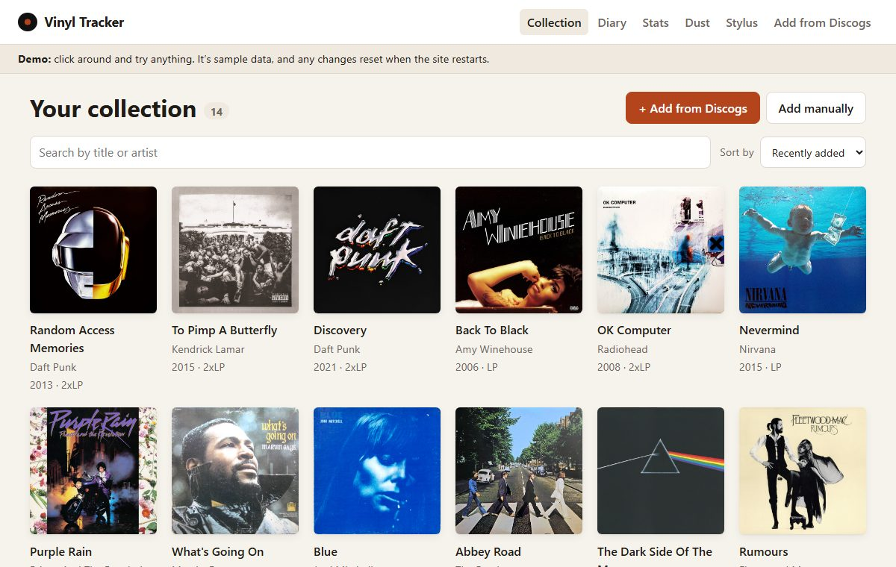
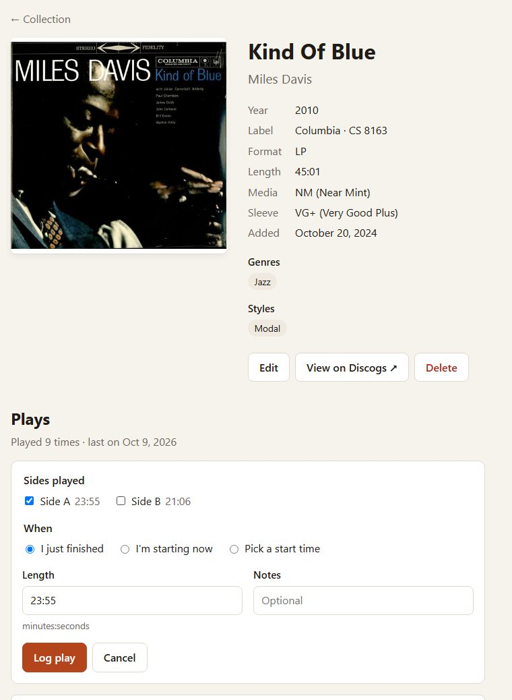
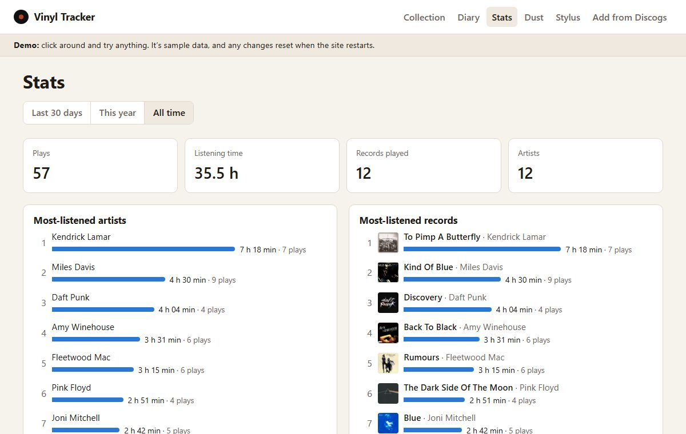
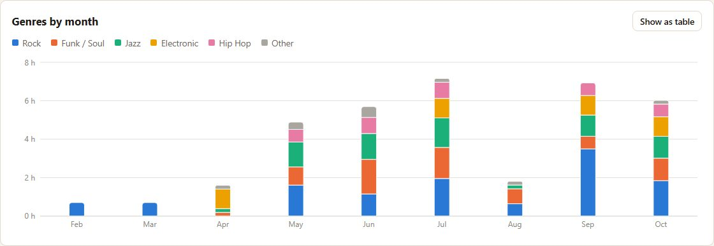
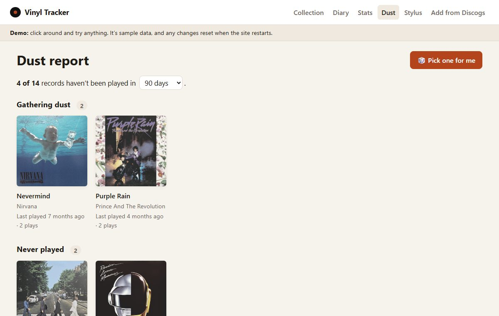
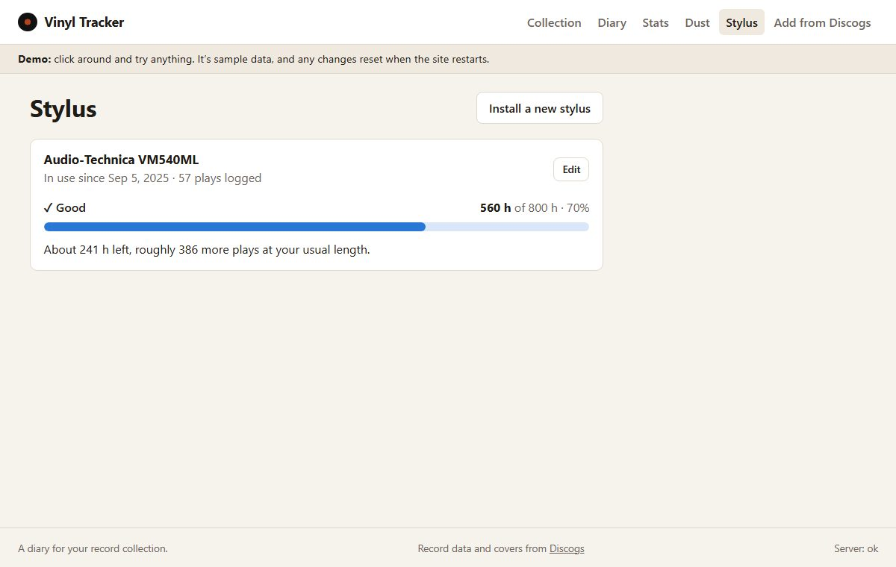
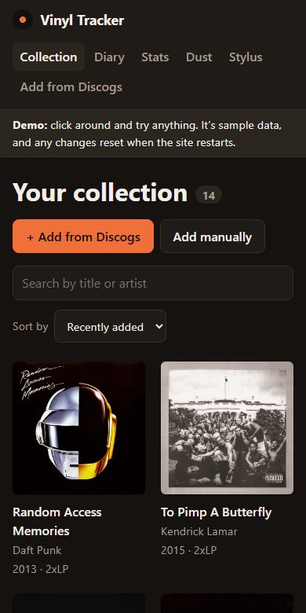

# Vinyl Tracker

[](https://github.com/danielcoria/vinyl-tracker/actions/workflows/ci.yml)

**A diary for your record collection.** Track the vinyl you own, log what you play side by side, and see your listening stats, the records gathering dust on your shelf, and how worn your turntable's stylus is.

### 🔗 Live demo: [vinyl-tracker-qu7q.onrender.com](https://vinyl-tracker-qu7q.onrender.com)

The demo is filled with 14 sample albums and about six months of listening, so every page has something to show. Click around and try anything; it resets to the sample data whenever the server restarts.

> **Heads-up:** the demo runs on a free server. After 15 minutes without visitors it sleeps, and the next visit takes about a minute. After that it's fast.



## What it does

- **Collection.** Search Discogs and add the exact pressing you own in one click (cover, label, catalog number, tracklist, genres), or add records by hand. Search and sort your shelf.
- **Listening diary.** Log each play by side: tick the sides you played (A, B, C…), and the length fills itself in from the tracklist. Every play lands in a diary, grouped by day.
- **Stats.** Most-listened artists and records, plus a chart of how your listening moves between genres month by month. Ranked by listening time, so one side counts for less than a whole double album.
- **Dust report.** Records you haven't played in a while (you choose how long), and ones you've never played. "Pick one for me" opens a random forgotten record.
- **Stylus wear tracker.** Turntable styluses wear out after a few hundred to a thousand-plus hours. Your logged plays add up against the stylus's rated lifespan, and a warning appears when it's time to replace it.

## Screenshots

| Logging a play, side by side                                                                | Listening stats                                                              |
| ------------------------------------------------------------------------------------------- | ---------------------------------------------------------------------------- |
|                           |              |
| **Genres by month**                                                                         | **Dust report**                                                              |
|  |  |
| **Stylus wear**                                                                             | **On a phone, in dark mode**                                                 |
|                                        |    |

## How it's built

| Part         | Technology                                                                                              |
| ------------ | ------------------------------------------------------------------------------------------------------- |
| Website      | React, TypeScript, Vite, React Router, TanStack Query, Recharts                                         |
| Server       | Node.js, Express, TypeScript                                                                            |
| Database     | SQLite (better-sqlite3) with Drizzle ORM and versioned migrations                                       |
| Shared rules | Zod schemas used by both the website and the server, so they always agree on what valid data looks like |
| Outside data | Discogs API (records, covers, tracklists)                                                               |
| Testing      | Vitest, Supertest, React Testing Library, Playwright                                                    |
| Delivery     | Docker, GitHub Actions, Render                                                                          |

```
 Browser ──▶ Website (React) ──/api──▶ Server (Express) ──▶ SQLite database
                                            │
                                            └──▶ Discogs API (token stays on the server)
```

A few decisions worth mentioning:

- **The Discogs token never reaches the browser.** The website only talks to its own server, which talks to Discogs. It stays under Discogs' limit of 60 requests a minute and remembers recent answers.
- **Derived numbers are never stored.** Play counts, "last played", dust status, stylus wear and stats are all worked out from the diary when asked, so they can't drift out of sync.
- **Plays are saved by start time and by track,** so plays logged later with a past date still count for the right stylus, and song-level stats or Last.fm scrobbling can be added later without reshaping the data.
- **Charts are checked for color blindness.** The chart colors were run through a colorblind-safety checker in both light and dark mode, and every chart has a table view.

## Testing and CI

- **220+ unit and integration tests** cover the server (every API route, against a temporary in-memory database) and the website (screens tested the way a person uses them).
- **6 end-to-end tests** drive a real Chrome browser through the whole app: adding and editing records, importing from Discogs, logging a play and seeing it in the diary and stats, the dust report and the stylus warning. They run against a fake Discogs and a fresh database every time.
- **On every push, GitHub Actions** runs formatting, lint, type checks, all tests and the build on Node 22 and 24, the end-to-end tests, and builds and smoke-tests the Docker image (including that data survives a restart).
- **The live demo only updates after all of those pass.**

## Run it on your computer

You need [Node.js](https://nodejs.org) 22 or newer.

```bash
git clone https://github.com/danielcoria/vinyl-tracker.git
cd vinyl-tracker
npm install
cp .env.example .env            # then add your Discogs token to .env (optional)
npm run db:seed -w server       # optional: some sample records
npm run dev
```

Then open **http://localhost:5173**.

The Discogs token is only needed for "Add from Discogs". You can get one free at [discogs.com/settings/developers](https://www.discogs.com/settings/developers) ("Generate new token"). Everything else works without it.

| Command                              | What it does                                        |
| ------------------------------------ | --------------------------------------------------- |
| `npm run dev`                        | Start the website and server, reloading as you edit |
| `npm test`                           | Run the unit and integration tests                  |
| `npm run test:e2e`                   | Run the end-to-end browser tests                    |
| `npm run lint` / `npm run typecheck` | Check the code                                      |
| `npm run build` then `npm start`     | Build and run it the way it runs online             |

## Project layout

```
client/   the website (React)
server/   the server (Express) and the database
shared/   the data rules both sides use
e2e/      end-to-end browser tests
docs/     guides: how it works, and how it's deployed
```

New to the code? **[docs/HOW-IT-WORKS.md](docs/HOW-IT-WORKS.md)** walks through every part in plain language. Deployment details are in **[docs/DEPLOY.md](docs/DEPLOY.md)**.

## What's next

The plan is to grow this into a "Letterboxd for physical music":

- **Accounts**, so everyone has their own collection and diary
- **Public profiles** to share your shelf and your year in records
- **Ratings and reviews** on records and on diary entries
- **"What should I play tonight?"** suggestions from your own shelf
- **Streaming vs. shelf:** albums you stream a lot on Last.fm but don't own, with current Discogs prices
- **Recommendations** based on what you own

## Credits

Record data and cover images come from [Discogs](https://www.discogs.com).
